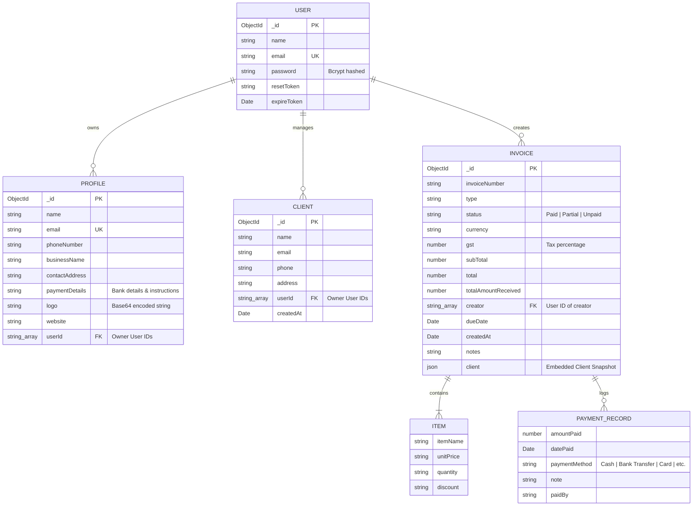
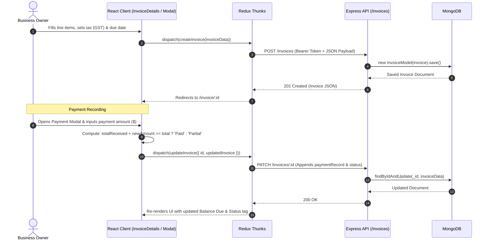
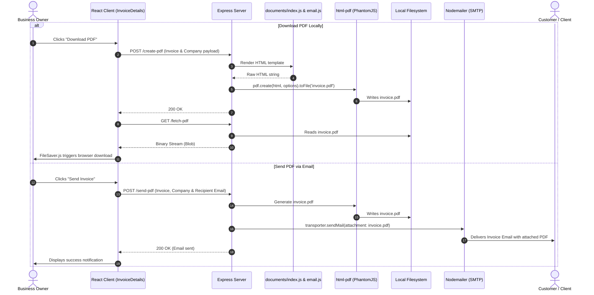
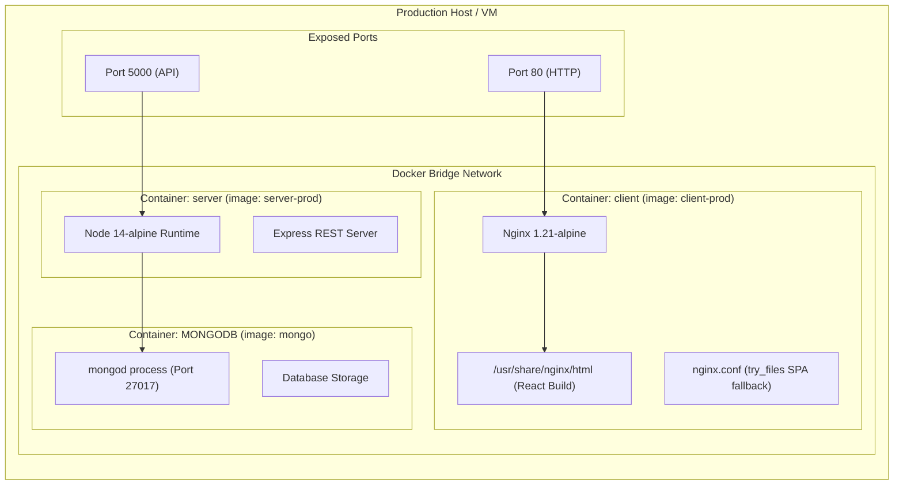

# Finbook - End-to-End Architecture Documentation

## 1. Executive Summary

**Finbook** is a full-stack financial billing and invoice management platform built on the **MERN** stack (MongoDB, Express.js, React, Node.js). It enables businesses and freelancers to manage clients, issue and track customizable invoices, record partial or full payments, compile server-side PDF documents, and deliver invoices to clients via automated SMTP email services.

---

## 2. High-Level System Architecture

```mermaid
flowchart TB
    subgraph ClientTier ["Frontend Tier (Client SPA)"]
        Browser["User Browser / Client Device"]
        subgraph ReactApp ["React 17 SPA (Port 3000 / 80)"]
            Router["React Router v5 (Navigation)"]
            ReduxStore["Redux Toolkit Store\n(auth, invoices, clients, profiles)"]
            MUI["Material-UI v4 Theme\n(Glassmorphic Design)"]
            Charts["Analytics Visualizations\n(ApexCharts / Recharts / DevExpress)"]
            AxiosClient["Axios HTTP Client\n(JWT Interceptor)"]
        end
    end

    subgraph IngressTier ["Web Server & Ingress Tier"]
        Nginx["Nginx 1.21 Reverse Proxy / Web Server\n(Port 80 - SPA Fallback & Static Files)"]
    end

    subgraph ServerTier ["Backend Tier (Express REST API - Port 5000)"]
        ExpressApp["Express.js App Engine (server/index.js)"]
        
        subgraph Middleware ["Middleware Pipeline"]
            Cors["CORS Handler"]
            BodyParser["JSON / URL-Encoded Parser (30MB Limit)"]
            AuthGuard["Auth Middleware (Custom JWT + Google Token Decoder)"]
        end

        subgraph Controllers ["Controllers & Routes"]
            UserCtrl["User Controller\n(/users - Auth & Password Reset)"]
            InvoiceCtrl["Invoice Controller\n(/invoices - CRUD & Totals)"]
            ClientCtrl["Client Controller\n(/clients - Paginated Directory)"]
            ProfileCtrl["Profile Controller\n(/profiles - Business Branding)"]
            PdfEngine["PDF & Email Engine\n(/create-pdf, /fetch-pdf, /send-pdf)"]
        end
    end

    subgraph DataTier ["Persistence Tier"]
        MongoDB[("MongoDB (Port 27017)\nMongoose ODM")]
    end

    subgraph ExternalServices ["External Integrations"]
        GoogleAuth["Google Identity Services\n(OAuth 2.0 Client Auth)"]
        SMTPServer["SMTP Mail Server\n(Nodemailer - Invoices & Passwords)"]
        PhantomJS["html-pdf / PhantomJS Engine\n(HTML to PDF Rasterizer)"]
    end

    %% Flow connections
    Browser -->|HTTP/HTTPS Port 80| Nginx
    Nginx -->|Static Assets / index.html| ReactApp
    Browser -->|OAuth Login| GoogleAuth
    GoogleAuth -.->|Credential Token| ReactApp

    ReactApp -->|REST API Requests (Port 5000)| ExpressApp
    ExpressApp --> Middleware
    Middleware --> Controllers

    UserCtrl -->|CRUD| MongoDB
    InvoiceCtrl -->|CRUD| MongoDB
    ClientCtrl -->|CRUD| MongoDB
    ProfileCtrl -->|CRUD| MongoDB

    PdfEngine -->|Render HTML Template| PhantomJS
    PhantomJS -->|Generate invoice.pdf| ExpressApp
    PdfEngine -->|Send Email with Attachment| SMTPServer
    SMTPServer -->|Deliver Email| Browser
```

---

## 3. Tier-by-Tier Architecture

### 3.1. Frontend Presentation Layer (`/client`)

- **Runtime & Library**: React 17 SPA bootstrapped with Create React App.
- **Routing**: `react-router-dom` v5 providing declarative routing:
  - **Public Routes**: `/` (Home/Landing), `/login`, `/forgot`, `/reset/:token`
  - **Authenticated Routes**: `/dashboard`, `/invoices`, `/invoice` (Creator), `/edit/invoice/:id`, `/invoice/:id` (Invoice Details & Actions), `/customers` (Client Management), `/settings` (Company Profile)
- **State Management**: Centralized store managed via **Redux Toolkit** (`@reduxjs/toolkit`):
  - `authSlice.js`: Authentication state, user profile caching, and JWT persistence in `localStorage`.
  - `invoiceSlice.js`: Invoice collection, single invoice cache, active filters, and async CRUD thunks.
  - `clientSlice.js`: Customer records, pagination state, and customer search filters.
  - `profileSlice.js`: Company metadata (logo, address, bank/payment details, contact information).
- **UI Components & Theme**: Material-UI (v4) configured with custom glassmorphic styling (`backdropFilter: 'blur(16px)'`, card elevation, Outfit/Inter typography).
- **Analytics & Dashboards**:
  - `react-apexcharts`, `recharts`, and `@devexpress/dx-react-chart-material-ui` used in `Dashboard.js` to render total revenue, overdue receivables, and recent payment history.
- **Network Layer**: Axios instance with automatic request interceptors injecting `Authorization: Bearer <token>` into outgoing HTTP headers.

---

### 3.2. Application & API Tier (`/server`)

- **Runtime**: Node.js (ES Module mode: `"type": "module"`).
- **Web Framework**: Express 4.17.1 running on port `5000` (configurable via `PORT` environment variable).
- **Request Processing Pipeline**:
  1. `cors()`: Cross-Origin Resource Sharing.
  2. `express.json({ limit: "30mb" })` & `express.urlencoded({ limit: "30mb" })`: High capacity parser to accommodate Base64 logo uploads and rich document payloads.
  3. `middleware/auth.js`: Dual authentication mechanism:
     - **Custom JWT**: Tokens with length `< 500` verified against `SECRET`.
     - **Google OAuth**: Tokens with length `>= 500` decoded to extract Google subject ID (`sub`).

#### API Routes & Responsibilities

| Endpoint Prefix | Primary Controller | Functionality |
| :--- | :--- | :--- |
| `/users` | `controllers/user.js` | User signup (`bcryptjs` hashing), signin (JWT issue), password reset requests with crypto token. |
| `/invoices` | `controllers/invoices.js` | Create invoice, update payment status, get by creator ID, count invoices for sequence numbers. |
| `/clients` | `controllers/clients.js` | Client directory management, paginated fetching (8 per page), owner-specific queries. |
| `/profiles` | `controllers/profile.js` | Company profile management, Base64 logo persistence, payment detail storage. |
| `/create-pdf` | `index.js` | Invokes `html-pdf` to compile `documents/index.js` template to physical `invoice.pdf`. |
| `/fetch-pdf` | `index.js` | Serves compiled `invoice.pdf` binary stream to the browser for direct download. |
| `/send-pdf` | `index.js` | Renders PDF and executes `nodemailer.sendMail` with HTML email template and PDF attachment. |

---

### 3.3. Document & Notification Engine

1. **PDF Compilation Engine**:
   - Compiles dynamic HTML templates (`server/documents/index.js`) using `html-pdf` backed by PhantomJS.
   - Outputs standard A4 document layout with invoice items, taxes, branding, and payment instructions.
2. **SMTP Dispatch Pipeline**:
   - `nodemailer` transport connected via `SMTP_HOST`, `SMTP_PORT`, `SMTP_USER`, and `SMTP_PASS`.
   - Sends rich HTML transaction emails (`server/documents/email.js`) attaching the compiled `invoice.pdf`.
   - Sends password reset emails with single-use crypto-signed reset links (1-hour TTL).

---

### 3.4. Persistence Layer (MongoDB & Mongoose)

- **Database**: MongoDB instance (default port `27017`), managed through Mongoose 5 ODM.
- **Connection**: Managed via `mongoose.connect(DB_URL)` with fallback to `mongodb://127.0.0.1:27017/finbook`.

---

## 4. Database Entity Relationship (ER) Diagram



---

## 5. End-to-End Workflow Sequence Diagrams

### 5.1. Invoice Creation & Payment Lifecycle



### 5.2. PDF Rendering & Email Dispatch Workflow



---

## 6. Containerization & Deployment Topology

The project provides multi-container deployment via `docker-compose.prod.yml`:



- **Client Dockerfile**: Multi-stage build (`node:14-alpine` builder creates production bundle; `nginx:1.21.0-alpine` serves static files on port 80 with SPA fallback).
- **Server Dockerfile**: Node.js 14 Alpine environment running Express API on port 5000.
- **Mongo Container**: Official MongoDB image exposing port 27017 to the internal network.

---

## 7. Architectural Observations & Production Hardening

1. **PDF Generation Race Conditions**:
   - In `server/index.js`, `/create-pdf` and `/send-pdf` write to a static file (`${__dirname}/invoice.pdf`).
   - *Impact*: Concurrent requests overwrite each other, causing wrong invoice attachments.
   - *Fix*: Generate unique file paths per request (e.g. `/tmp/invoice-${uuid}.pdf`) or stream generated PDF buffers directly in memory.
2. **Headless Engine Replacement**:
   - `html-pdf` utilizes PhantomJS (deprecated).
   - *Fix*: Migrate to modern headless engines such as `puppeteer`, `playwright`, or `@react-pdf/renderer`.
3. **Asset Storage**:
   - Logos are stored as Base64 strings directly in MongoDB.
   - *Fix*: Offload binary media to Cloud Object Storage (e.g., AWS S3, Cloudinary) and store only public asset URLs.
